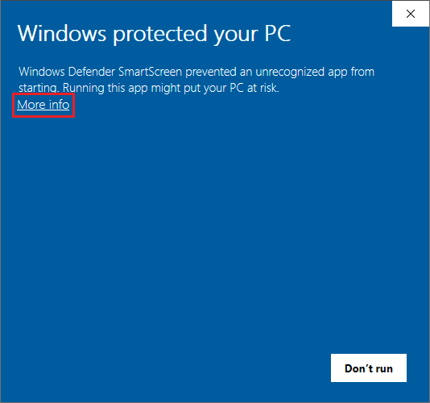
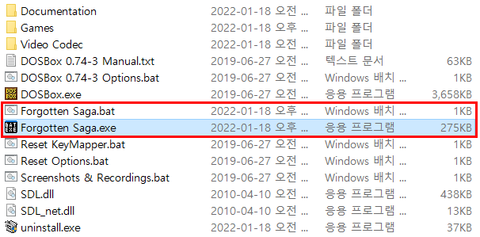

## What is this
Batch Executor is an EXE program that executes a BAT file of the same name in the same path.

  

## How to run
You can download Release File and Source Code [Here](https://github.com/jfri13/Batch-Executor/releases).

**Method 1**. Download the Release File and Run it, SmartScreen will block it.

\
Click More Info and then Click Run Anyway.

 

**Method 2**. If you cannot download Release File, you can download the Source Code and Build it yourself.\
Open the Solution File in Visual Studio and Build it.\
Most of functions are included in Form1, and use it by modifying it as needed.\
There are no viruses in the code.

  

## How to use

For example if you run Forgotten Saga.exe then Forgotten Saga.bat will run.\
This program can be used to add emulator games on the Steam launcher or to create a shortcut on the desktop.

  

## Localization
Korean and English are supported, and there is no plan to provide a release that supports other languages.\
Because supporting other languages ​​is not important to the program.\
However, you can also output messages in other languages ​​by adding them directly to your source code.

  

## Contact Info
* Email: jfri13@naver.com
