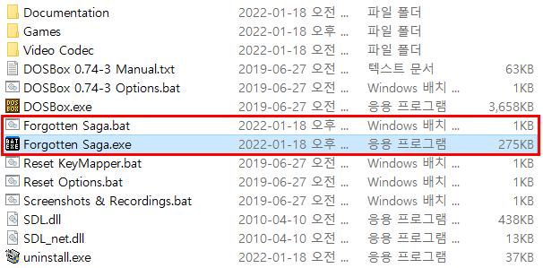

## 개요
Batch Executor는 같은 경로의 같은 이름의 BAT 파일을 실행하는 EXE 프로그램입니다.

  

## 실행방법
[여기](https://github.com/jfri13/Batch-Executor/releases)에서 Release 파일 및 소스 코드를 다운로드할 수 있습니다.

**방법 1**. Release 파일을 다운로드하고 실행하면 SmartScreen이 차단합니다.

\
추가 정보를 클릭한 다음 실행을 클릭합니다.

 

**방법 2**. Release 파일을 다운로드할 수 없는 경우 소스 코드를 다운로드하여 직접 빌드할 수 있습니다.\
Visual Studio에서 BatchExecutor라는 프로젝트를 만들고 언어에 맞는 코드를 추가하여 빌드합니다.\
코드에 바이러스는 없습니다.

  

## 사용방법
\
예를 들어 Forgotten Saga.exe를 실행하면 Forgotten Saga.bat가 실행됩니다.\
이 프로그램은 Steam 런처에 에뮬레이터 게임을 추가하거나 바탕 화면에 바로 가기를 만드는 데 사용할 수 있습니다.

  

## 현지화
한국어와 영어를 지원하며, 다른 언어를 지원하는 릴리스를 제공할 계획은 없습니다.\
다른 언어를 지원하는 것은 프로그램에 중요하지 않기 때문입니다.\
그러나 소스 코드에 직접 추가하여 다른 언어로 메시지를 출력할 수도 있습니다.

  

## 연락처
* Email: jfri13@naver.com
* 티스토리: https://jfri13.tistory.com/